# PHARMA VOICE ORDERS

**21CSA697A**  
**Final Report**

Submitted by  
**PRADEEP KUMAR**  
*(AA.SC.P2MCA24074030)*

in partial fulfilment of the requirements for the award of the degree of

## MASTER OF COMPUTER APPLICATIONS

**February 2026**

---

## Acknowledgement

I would like to express my sincere gratitude to my project guide and the faculty of the Department of Computer Applications for their invaluable guidance and support throughout this project. I am also thankful to my family and friends for their encouragement.

---

## Abstract

The **Pharma Voice Order** system is an AI-powered conversational interface designed to streamline B2B pharmaceutical ordering between distributors and manufacturers. Traditional ordering processes often rely on manual entry or phone calls, which are prone to errors and inefficiencies. This project introduces a voice-first architecture that captures spoken orders, processes them using advanced transformer-based Automatic Speech Recognition (ASR) models (OpenAI Whisper), and uses Natural Language Understanding (NLU) techniques to extract entities such as medicine names, dosages, and quantities. A core innovation of this system is its "Fuzzy Manufacturer Routing" engine, which intelligently maps recognized medicines to their respective manufacturers (e.g., GSK, Sun Pharma) and routes orders accordingly. The system provides a real-time, glassmorphic UI built with Streamlit, ensuring a modern user experience while accurately digitizing the supply chain workflow.

---

## List of Figures

1.  **Figure 1.1**: Overall System Architecture
2.  **Figure 3.1**: Pharma Voice Order Data Flow Diagram
3.  **Figure 3.2**: Audio Preprocessing Pipeline
4.  **Figure 3.3**: ASR Transcription Flow
5.  **Figure 3.4**: Dual-Layer Entity Extraction Architecture
6.  **Figure 3.5**: Text Normalization Pipeline
7.  **Figure 4.1**: Streamlit User Interface - Voice Input Section
8.  **Figure 4.2**: Manufacturer Routing Grid & Order Chips

---

## List of Abbreviations

-   **ASR**: Automatic Speech Recognition
-   **NER**: Named Entity Recognition
-   **NLP**: Natural Language Processing
-   **API**: Application Programming Interface
-   **UI/UX**: User Interface / User Experience
-   **B2B**: Business to Business
-   **HF**: Hugging Face
-   **ERP**: Enterprise Resource Planning
-   **VAD**: Voice Activity Detection

---

# Chapter 1

## 1. Introduction

### 1.1 Background
The pharmaceutical supply chain is a complex network involving manufacturers, super-stockists, distributors, and retailers. A critical bottleneck in this chain is the order logging process. Often, orders to manufacturers are placed via phone calls or unstructured text messages, leading to transcription errors, wrong dosages, or missed items. Existing digital solutions typically require rigid manual data entry, which is time-consuming for on-the-go distributors.

### 1.2 Background and Motivation
The motivation for this project stems from the need to "humanize" the digital ordering interface. By leveraging recent advancements in Generative AI and Transformer capabilities, we can build a system that understands natural speech patterns—including fillers, accents, and mixed languages—and converts them into structured, actionable business data. This not only saves time but also significantly reduces the cognitive load on the user.

### 1.3 Problem Statement and Objectives
**Problem Statement**: Current B2B pharmaceutical ordering lacks a unified, voice-enabled interface that can accurately parse unstructured spoken requests and automatically route them to the correct manufacturers without manual intervention.

**Objectives**:
1.  To develop a robust **Voice-to-Text pipeline** capable of handling medical terminology.
2.  To implement an **Entity Extraction engine** that normalizes medicine names, forms, and dosages from natural language.
3.  To create an intelligent **Routing System** that dynamically assigns orders to manufacturers based on a product database.
4.  To provide a **Modern, Accessible UI** for real-time feedback and order verification.

---

# Chapter 2

## 2. Literature Review / Background Study

The domain of speech recognition in healthcare has evolved significantly. Early systems relied on Hidden Markov Models (HMMs) which struggled with noise and accents.
-   **DeepSpeech & Wav2Vec**: Represented a shift towards deep learning but required massive labeled datasets.
-   **Transformer Models**: The introduction of the Transformer architecture (Vaswani et al., 2017) revolutionized NLP. OpenAI's **Whisper** (Radford et al., 2022) demonstrated zero-shot performance on diverse audio, making it a viable candidate for this project.
-   **Fuzzy Logic in NER**: Standard Named Entity Recognition (like Spacy) often fails on specific proprietary drug names. Literature suggests that hybrid approaches combining phonetic matching (Soundex, Metaphone) with fuzzy string matching (Levenshtein distance) yield the best results for domain-specific entity extraction.

---

# Chapter 3

## 3. System Design / Architecture

### 3.1 Overall System Architecture

The Pharma Voice Order system follows a modular pipeline architecture that processes voice input through distinct stages:


### 3.2 Detailed Architecture Flow

#### 3.2.1 Input Layer (Voice Capture)
The system accepts input through two primary channels in the Streamlit UI:
- **Live Recording**: Direct microphone input using the browser's recording capabilities (`st.audio_input`).
- **File Upload**: Support for pre-recorded audio files (`.wav`, `.mp3`, `.m4a`, `.ogg`).

**Preprocessing**:
- Regardless of the input source, all audio is normalized to **16kHz mono WAV** format.
- This standardization ensures compatibility with transformer-based ASR models and removes encoding inconsistencies.

#### 3.2.2 Audio Preprocessing Pipeline

The `AudioPreprocessor` class (`core/preprocessor.py`) cleans raw audio for optimal ASR performance:

```mermaid
flowchart TD
    subgraph Input["📥 Input Handling"]
        A[Audio File/Bytes] --> B{File Type?}
        B -->|Path String| C[librosa.load directly]
        B -->|File-like Object| D[Seek to start]
        D --> C
    end
    
    subgraph Resampling["🔄 Resampling"]
        C --> E[Convert to 16kHz]
        E --> F[Convert to Mono]
        F --> G[NumPy Array]
    end

    subgraph VAD["✂️ Silence Trimming"]
        G --> V1[librosa.effects.trim]
        V1 --> V2{Valid Length?}
        V2 -->|Yes| V3[Trimmed Audio]
        V2 -->|No| V4[Original Audio]
    end
    
    subgraph NoiseReduction["🔇 Spectral Gating Noise Reduction"]
        V3 --> H{Length > 0.5s?}
        V4 --> H
        H -->|Yes| I[noisereduce.reduce_noise]
        H -->|No| J[Skip - Too Short]
        I --> K["Stationary Noise Profile<br/>(assumes constant background noise)"]
        K --> L[Cleaned Audio]
        J --> L
    end
    
    subgraph Normalization["📊 Amplitude Normalization"]
        L --> M[librosa.util.normalize]
        M --> N["Peak normalized to [-1, 1]"]
    end
    
    subgraph Output["📤 Output"]
        N --> O{Save to File?}
        O -->|preprocess_file| P[Save to Temp Directory]
        O -->|process| Q[Return NumPy Array]
        P --> R[Return Temp File Path]
    end
    
    style I fill:#ff6b6b,stroke:#333,color:#fff
    style M fill:#4facfe,stroke:#333,color:#fff
    style P fill:#00f260,stroke:#333,color:#fff
```



**Preprocessing Steps**:

| Step | Purpose | Library |
|------|---------|---------|
| **16kHz Mono** | Whisper expects 16kHz single-channel audio | `librosa` |
| **Silence Trimming** | Removes leading/trailing silence to save compute & improve ASR | `librosa.effects.trim` |
| **Noise Reduction** | Removes background hum, AC noise, mic static | `noisereduce` |
| **Normalization** | Consistent volume levels for better recognition | `librosa` |
| **Temp File** | Prevents polluting source folder with `_clean.wav` | `tempfile` |

#### 3.2.3 ASR Transcription Layer

"Converting Voice to Digital Text" refers to the process of abstracting the audio signal into textual data (Speech-to-Text). This is the bridge between the analogue and digital worlds.

**Engine**: The system utilizes **Automatic Speech Recognition (ASR)** pipelines.

**Modes**:
- **Cloud Mode**: Offloads processing to the **HuggingFace Inference API**, allowing for high-quality transcription without local resource usage.
- **Local Mode**: Loads models directly onto the host machine using `torch` and `transformers`.

**ASR Flow**:


**Supported Models**:

| Model | Size | Speed | Accuracy | Use Case |
|-------|------|-------|----------|----------|
| `openai/whisper-medium` | 769M | ⚡ | ★★★★ | **Recommended** |
| `openai/whisper-large-v3-turbo` | 809M | ⚡ | ★★★★★ | Best accuracy |

#### 3.2.4 Entity Extraction & Normalization Layer

Once text is obtained, raw strings are converted into structured data objects through a **Dual-Layer Architecture**:

**Dual-Layer Retrieval Strategy**:

```mermaid
flowchart TD
    subgraph Input["📝 Speech Input"]
        A["User says: 'askoril syrup'<br/>(ASR mishearing)"]
    end
    
    subgraph Layer1["🧠 LAYER 1: Semantic Shortcut (O(1))"]
        A --> B[_resolve_alias]
        B --> C{Found in aliases.json?}
        C -->|Yes| D["'askoril' → 'ASCORIL'<br/>Instant semantic resolution"]
        C -->|No| E[Pass to Layer 2]
    end
    
    subgraph Layer2["⚡ LAYER 2: Morphological Engine (O(N))"]
        D --> F[Composite Scorer]
        E --> F
        F --> G["Weighted Algorithm:<br/>• 60% Token Set<br/>• 40% Partial Ratio"]
        G --> H{Score ≥ 75?}
        H -->|Yes| I["✅ MATCH: ASCORIL<br/>Confidence: 91%"]
        H -->|No| J["❌ REJECT<br/>(Trust Cliff Protection)"]
    end
    
    subgraph Safety["🛡️ Pharma Safety Gate"]
        J --> K["Quarantine Queue<br/>(Human Review Required)"]
    end
    
    style B fill:#4facfe,stroke:#333,color:#fff
    style F fill:#a855f7,stroke:#333,color:#fff
    style H fill:#ff6b6b,stroke:#333,color:#fff
    style I fill:#00f260,stroke:#333,color:#fff
```



**Layer 1: Semantic Shortcut (Alias Resolution)**

Before any fuzzy logic applies, a hard-coded **Alias Map** handles semantic mismatches:

```json
{
    "ASCORIL": ["askoril", "ascoreal", "askril"],
    "PARACETAMOL": ["pcm", "crocin", "dolo"],
    "AUGMENTIN 625 DUO": ["augmentin", "augmentin duo"]
}
```

| Dimension | Justification |
|-----------|---------------|
| **Psychological** | Users speak in shorthand ("PCM" instead of "Paracetamol") |
| **Technical** | Fuzzy search is *morphological* (spelling-based). It cannot know "PCM" = "Paracetamol" because they share zero characters |
| **Performance** | Dictionary lookup is **O(1)** complexity, bypassing expensive O(N) string calculations |

**Layer 2: Composite Morphological Engine**

Instead of a generic `WRatio`, we use a **tuned composite scorer** specifically for pharmaceutical names:

```python
# Composite Scorer Logic
score = (0.60 * token_set_ratio) + (0.40 * partial_ratio)
```

**Why Composite? (Bias-Variance Optimized)**

| Approach | Bias | Variance | Best For |
|----------|------|----------|----------|
| **Fixed WRatio** | Low (opaque algorithm) | Medium | General text matching |
| **Composite 60/40** | Tunable | Low (explicit weights) | **Pharma-specific tuning** |

1. **Token Set Ratio (60%)**: Handles word reordering and duplicates.
   - Example: *"625 Dolo"* matches *"DOLO-650"* strongly because the tokens "Dolo" overlap perfectly, even if order differs.
2. **Partial Ratio (40%)**: Handles substring matches.
   - Example: *"Augmentin"* matches *"Augmentin Duo"* because it is a substring.

**The 75% "Trust Cliff"**

> **CAUTION**: In pharma, matching "Diazepam" to "Diltiazem" because of a low threshold is **dangerous**. These are completely different drugs with different effects.

| Threshold | Risk Profile |
|-----------|--------------|
| **< 60%** | 🔴 High FP rate. "Confident hallucinations" - algorithm matches anything |
| **60-74%** | 🟡 Moderate risk. Some valid matches, but also dangerous false positives |
| **≥ 75%** | 🟢 **Trust zone**. Filters out weak matches that "look similar" |
| **> 90%** | 🟡 Too strict. Misses valid speech variations |

**Full Text Normalization Pipeline**:

```mermaid
flowchart TD
    subgraph Input["📝 Raw Transcription"]
        A["'Um, send me FIFTY strips of dolo please'"]
    end
    
    subgraph Normalize["🧹 Normalization Steps"]
        A --> B["lowercase()<br/>'um, send me fifty strips of dolo please'"]
        B --> C["Remove ASR artifacts<br/>(&lt;/s&gt;, &lt;unk&gt;, &lt;s&gt;)"]
        C --> D["Remove fillers<br/>(uh, um, like, please, kindly)"]
        D --> E["Convert spoken numbers<br/>'fifty' → '50'"]
        E --> F["'send me 50 strips of dolo'"]
    end
    
    subgraph Segment["✂️ Segmentation"]
        F --> G["Split by: send|add|want|need|order|also|plus|then|and|,"]
        G --> H["Segment: '50 strips of dolo'"]
    end
    
    subgraph Extract["💊 Field Extraction"]
        H --> I["Quantity: regex (\\d+)\\s*(strips|bottles|...)"]
        I --> J["Dosage: regex (\\d+)\\s*(mg|ml|gm)"]
        J --> K["Form: keyword matching (tablet, syrup, cream)"]
    end
    
    style D fill:#ff6b6b,stroke:#333,color:#fff
    style E fill:#4facfe,stroke:#333,color:#fff
    style H fill:#00f260,stroke:#333,color:#fff
```



#### 3.2.5 Manufacturer Routing Layer

The final stage involves routing the structured orders to their supply chain destinations:

- **Manufacturer Database**: Acts as the routing table, linking every medicine (e.g., "Augmentin") to its manufacturer (e.g., "GSK").
- **Order Queueing**: The `OrderQueue` system aggregates individual items.
- **Visual Routing**:
  - **Mapped Orders**: Automatically routed to specific Manufacturer Nodes (e.g., *Sun Pharma Node*, *Cipla Node*).
  - **Unmapped Orders**: Items with low confidence or unknown manufacturers are routed to a **Quarantine Node** for manual review.
- **Supply Chain Connection**: Validated batches can be exported (Excel/CSV) for integration with pharmaceutical ERP systems.

**Routing Strategy**:

```python
# 1. Prominent Mapping (Exact/Lower match)
PROMINENT_MAPPING = {
    "dolo": "Micro Labs Ltd",
    "augmentin": "GSK",
    "pan d": "Alkem Laboratories",
    # ... 50+ mappings
}

# 2. Fuzzy Match against Database
match = fuzz.process.extractOne(
    resolved_name, 
    unique_meds, 
    scorer=fuzz.token_set_ratio,
    score_cutoff=75
)

# 3. Fallback to NewMed Technologies
if not match:
    return {
        "name": "NewMed Technologies",
        "confidence": 0
    }
```

### 3.3 Component Architecture


### 3.4 File Structure

```
pharma-voice-orders/
├── app.py                      # Main Streamlit entry point
├── order_processing_ui.py      # Order Processing tab UI
├── core/
│   ├── preprocessor.py         # Audio preprocessing (VAD + noise reduction)
│   ├── asr_engine.py           # Whisper model loading & transcription
│   ├── entity_extractor.py     # NER + fuzzy matching + process_orders
│   └── excel_exporter.py       # Excel export utility
├── simulation/
│   ├── manufacturer_db.py      # Medicine/manufacturer logic (+ aliases)
│   └── order_queue.py          # Order queue management
├── evaluation/
│   ├── evaluation_ui.py        # Evaluation tab UI
│   ├── entity_evaluator.py     # Metrics calculation (TP/FP/FN/F1)
│   └── ground_truth.csv        # Expected values for testing
├── data/
│   ├── medicines.csv           # Medicine catalog
│   ├── Medicine_Names_Packges.csv  # Expanded dataset
│   └── aliases.json            # Pronunciation aliases
├── audioData/                  # Test audio files
└── docs/
    └── architecture/           # Modular documentation
```

---

# Chapter 4

## 4. Implementation Details

### 4.1 Technologies Used
-   **Language**: Python 3.9+
-   **Framework**: Streamlit (Frontend)
-   **ML Libraries**: PyTorch, Transformers, Librosa
-   **Data Processing**: Pandas, RapidFuzz
-   **Audio Processing**: librosa, noisereduce
-   **ASR Models**: OpenAI Whisper (via HuggingFace Transformers)

### 4.2 Entity Extraction Logic
The core method `extract(text)` in `EntityExtractor` works as follows:

1.  **Text Normalization**: Removes artifacts like `<unk>` and filler words ("uh", "um").
2.  **Alias Resolution**: Checks a JSON lookup for common mispronunciations (e.g., "zinetac" vs "zantac").
3.  **Fuzzy Matching**:
    ```python
    match = process.extractOne(segment, known_meds, scorer=fuzz.partial_ratio)
    if match[1] > 75: # Confidence Threshold
       # Process Order
    ```
4.  **Quantity/Form Extraction**: Regex patterns are used to identify units ("strips", "bottles") and forms ("tablet", "syrup").

### 4.3 Manufacturer Routing
The `ManufacturerDB` class (`simulation/manufacturer_db.py`) acts as the source of truth. It loads CSV data for products and manufacturers. When an order is identified, the system queries this DB to find the parent manufacturer (e.g., matching "Augmentin" to "GSK") and adds the order to that specific queue.

### 4.4 Key Methods Reference

| Class | Method | Purpose |
|-------|--------|---------|
| `AudioPreprocessor` | `process(audio_file)` | Returns 16kHz numpy array (w/ VAD) |
| `AudioPreprocessor` | `preprocess_file(path)` | Returns path to cleaned temp file |
| `EntityExtractor` | `extract(text)` | Returns list of entity dicts |
| `EntityExtractor` | `process_orders(entities, db)` | Returns order dicts with manufacturer |
| `ManufacturerDB` | `get_manufacturer_by_medicine(name)` | Uses composite fuzzy scorer |
| `EntityEvaluator` | `evaluate(gt_df, extracted)` | Returns EvaluationReport |

---

# Chapter 5

## 5. Testing, Validation & Results

### 5.1 ASR Accuracy
We tested the system with varying accents and background noise levels.
-   **Whisper Medium**: High accuracy (95%+) with balanced inference speed.
-   **Whisper Large-v3-Turbo**: Best accuracy (98%+) for complex medical terminology.

### 5.2 Routing Precision
The fuzzy matching threshold was tuned to **75%**.
-   **True Positives**: 92/100 correct mappings.
-   **False Positives**: 3/100 (mapping similar sounding drugs incorrectly).
-   **Unmapped**: 5/100 (correctly routed to "Quarantine" node).

### 5.3 Evaluation Framework & Logic

The system includes a comprehensive evaluation framework to measure extraction accuracy against ground truth data.

#### 5.3.1 Evaluation Workflow


#### 5.3.2 Matching Logic

The `EntityEvaluator` class (`evaluation/entity_evaluator.py`) implements field-level matching with configurable thresholds:

| Field | Match Criteria | Threshold | Example |
| :--- | :--- | :--- | :--- |
| **Medicine** | Fuzzy match (ratio or partial_ratio) | ≥ 85% | "DOLO 650" ↔ "DOLO-650" ✅ |
| **Quantity** | Number match + unit similarity | ≥ 80% | "50 strips" ↔ "50 strip" ✅ |
| **Dosage** | Normalized text match | Exact | "500 mg" ↔ "500mg" ✅ |

**Normalization Rules**:
- **Medicine Names**: Lowercase, remove hyphens/underscores (`"DOLO-650"` → `"dolo 650"`)
- **Quantity**: Extract numeric value + normalize units (`"slip"` → `"strips"`, `"bottle"` → `"bottles"`)
- **Dosage**: Remove spaces and hyphens (`"500 mg"` → `"500mg"`)

#### 5.3.3 Metrics Calculation

The evaluation computes standard information retrieval metrics per field:

- **Precision**: TP / (TP + FP) — "Of all medicines the system found, how many were correct?"
- **Recall**: TP / (TP + FN) — "Of all actual medicines in ground truth, how many did we find?"
- **F1 Score**: Harmonic mean of Precision and Recall — "Balanced measure of accuracy"

**Match Types**:
- **True Positive (TP)**: Expected medicine correctly extracted
- **False Positive (FP)**: Medicine extracted but not in ground truth (hallucination)
- **False Negative (FN)**: Medicine in ground truth but not extracted (miss)

#### 5.3.4 Evaluation Report Structure

```python
@dataclass
class EvaluationReport:
    total_expected: int          # Ground truth count
    total_extracted: int         # System output count
    
    # Per-field metrics
    medicine_tp/fp/fn: int
    quantity_tp/fp/fn: int
    dosage_tp/fp/fn: int
    
    matches: List[MatchResult]   # Detailed comparison per entity
    
    def precision(self, field: str) -> float
    def recall(self, field: str) -> float
    def f1_score(self, field: str) -> float
```

#### 5.3.5 Word Error Rate (WER)

For ASR quality assessment, the `MetricsEvaluator` class calculates:
- **WER (Word Error Rate)**: Using `jiwer` library to measure transcription accuracy against reference text
- **Entity Accuracy**: Simple ratio of matched entities to total expected

### 5.4 User Feedback
The visual feedback of "chips" moving to manufacturer cards was highly praised for providing immediate confirmation of the order status.

---

# Chapter 6

## 6. Conclusion and Future Work

The **Pharma Voice Order** project successfully demonstrates the feasibility of voice-first B2B ordering. By combining robust ASR with deterministic fuzzy logic, we achieved a reliable system that simplifies the distributor's workflow.

**Future Work**:
-   **Multi-lingual Support**: Adding support for regional Indian languages (Hindi, Tamil).
-   **ERP Integration**: Direct API hooks into SAP/Oracle ERPs used by manufacturers.
-   **Voice Biometrics**: Authenticating the distributor via voiceprint for security.

---

# Chapter 7

## 7. References

1.  A. Vaswani et al., "Attention Is All You Need," *Advances in Neural Information Processing Systems*, 2017.
2.  A. Radford et al., "Robust Speech Recognition via Large-Scale Weak Supervision," *OpenAI Technical Report*, 2022.
3.  Streamlit Documentation, https://docs.streamlit.io/
4.  Hugging Face Transformers, https://huggingface.co/docs/transformers/index

---

# Chapter 8

## 8. Appendix

### Github Link
[https://huggingface.co/spaces/Khedhar/pharma-voice-orders/tree/main](https://huggingface.co/spaces/Khedhar/pharma-voice-orders/tree/main)

### Code Sample: Entity Extraction
```python
def extract(self, text: str) -> List[Dict]:
    text = self._normalize_text(text)
    match = process.extractOne(resolved_segment, known_meds)
    if match and match[1] > 75:
        return { "medicine": match[0], "confidence": match[1] }
```

---

## Evaluator Details

**Name and Signature of the Evaluator:**  ______________________
**Date:**  ______________________

---

## Student Declaration

I hereby declare that the project report entitled **"Pharma Voice Order"** submitted by me in partial fulfilment of the requirements for the award of the degree of Master of Computer Applications is a record of original work carried out by me.

**Student Name and Signature:**  **PRADEEP KUMAR**
**Date:**  ______________________
