# Pharma Voice Order Flow

This document outlines the end-to-end architecture of the **Pharma Voice Order** system, detailing how voice inputs are transformed into standardized pharmaceutical orders using high-performance GPU inference and intelligent routing.

---

## High-Level System Overview

```mermaid
flowchart TD
    subgraph Input["🎤 1. Voice Capture"]
        A[Live Recording / File Upload] --> B[16kHz Mono WAV]
        B --> C[VAD & Spectral Gating]
    end
    
    subgraph ASR["🧠 2. ASR Transcription"]
        C --> D[Google Colab T4 GPU]
        D --> E[OpenAI Whisper Medium/Large-v3]
        E --> F[Raw Transcription Text]
    end
    
    subgraph Extraction["⚡ 3. Dual-Layer Entity Extraction"]
        F --> G{Layer 1: Alias Resolution}
        G -->|O(1) Lookup| H[PCM → PARACETAMOL]
        G -->|Not Found| I[Layer 2: Fuzzy Matching]
        I --> J[Composite Scorer 60/40]
        J --> K{≥ 75% Confidence?}
        K -->|Yes| L[Extracted Entities]
        K -->|No| M[Quarantine Node]
    end
    
    subgraph Routing["� 4. Manufacturer Routing"]
        L --> N{Prominent Mapping?}
        N -->|Yes| O[Direct to Manufacturer]
        N -->|No| P[Fuzzy DB Lookup]
        P --> Q[Route to Mfr Node]
    end
    
    subgraph Output["📦 5. Output & Integration"]
        O --> R[Manufacturer Order Queue]
        Q --> R
        M --> S[Manual Review]
        R --> T[Excel/CSV Export]
        S --> U[Feedback to Alias Layer]
    end
    
    style Input fill:#e1f5fe,stroke:#333,color:#000
    style ASR fill:#f3e5f5,stroke:#333,color:#000
    style Extraction fill:#e8f5e9,stroke:#333,color:#000
    style Routing fill:#fff3e0,stroke:#333,color:#000
    style Output fill:#fce4ec,stroke:#333,color:#000
    style K fill:#ff6b6b,stroke:#333,color:#fff
    style L fill:#00f260,stroke:#333,color:#000
    style M fill:#ffcc80,stroke:#333,color:#000
```

---

## 1. Taking Input (Voice Capture)

The system accepts input through two primary channels in the Streamlit UI:
- **Live Recording**: Direct microphone input using the browser's recording capabilities (`st.audio_input`).
- **File Upload**: Support for pre-recorded audio files (`.wav`, `.mp3`, `.m4a`, `.ogg`).

**Preprocessing**:
- Regardless of the input source, all audio is normalized to **16kHz mono WAV** format.
- **VAD & Cleanup**: Silence trimming and spectral gating are applied to ensure only clear speech segments reach the ASR engine.

---

## 2. Converting Voice to Digital Text (Transcription)

"Converting Voice to Digital Text" refers to the process of abstracting the audio signal into textual data (Speech-to-Text).

- **Execution Environment**:
  - **Google Colab T4 GPU**: The system is optimized to run on **Google Colab's NVIDIA T4 GPU**, enabling lightning-fast inference for heavy Transformer models.
  - **Local/Cloud Hybrid**: While capable of running locally, the T4 acceleration ensures near real-time latency (< 200ms) even for long audio bursts.

---

## 3. Using Transformers

The core intelligence relies on state-of-the-art Transformer architectures:

- **Model**: **OpenAI Whisper (Medium/Large-v3)**
  - We exclusively use Whisper's advanced checkpoints for their superior zero-shot performance on medical terminology.
  - **Why not MedASR?**: Extensive testing revealed that general-purpose Whisper models (with adequate prompting) outperformed specialized but smaller models like Google MedASR in handling mixed-language input (Indian English + Hindi fillers).

- **Function**: The Transformer handles the "seq2seq" (sequence-to-sequence) task, mapping audio spectrograms to text tokens while automatically correcting for accents and background noise.

---

## 4. Standardizing (Dual-Layer Entity Extraction)

Once text is obtained, raw strings are converted into structured data objects through a **Fault-Tolerant Dual-Layer Architecture**:

### Layer 1: Semantic Shortcut (Alias Resolution)
- **O(1) Lookup**: A hardcoded dictionary resolves common phonetic/semantic mismatches immediately.
- **Example**: "PCM" -> **"PARACETAMOL"**; "Askoril" -> **"ASCORIL"**.

### Layer 2: Composite Morphological Engine
- **Algorithm**: A tunable "Fuzzy Logic" scorer (60% Token Set Ratio + 40% Partial Ratio).
- **Purpose**: Handles morphological variations (spelling mistakes, partial words).
- **Trust Cliff**: 
  - matches **≥ 75% confidence** are accepted.
  - matches **< 75%** are rejected to prevent dangerous drug confusion (e.g., *Diazepam* vs *Diltiazem*).

**Field Extraction**:
- **Medicine Name**: Matched against `ManufacturerDB`.
- **Form Detection**: Classifies items as *tablet, syrup, injection, cream, etc.* based on keywords.
- **Quantity/Dosage**: Regex-based extraction (e.g., "50 strips", "500mg").

---

## 5. Connecting to Routers & Manufacturers

The final stage involves routing the structured orders to their supply chain destinations:

- **prominent Mapping**: Immediate routing for high-volume known drugs (e.g., "Augmentin" -> **GSK**).
- **Fuzzy Routing**: Dynamic lookup in the `ManufacturerDB` for less common items.
- **Visual Routing**:
  - **Mapped Orders**: Automatically flow to their specific Manufacturer Nodes (e.g., *Sun Pharma Node*, *Cipla Node*).
  - **Unmapped Orders**: Items failing the Trust Cliff are routed to a **Quarantine Node** for manual pharmacist review.

---

## 6. Output & Integration

- **Digital Output**: Validated batches can be exported (Excel/CSV) for integration with pharmaceutical ERP systems.
- **Feedback Loop**: Corrections made in the Quarantine Node are fed back to improve the Alias Resolution layer.

---

# Appendix: Detailed Section Diagrams for Assignment

Below are individual Mermaid diagrams for each section that you can use to create separate flowchart images for your assignment:

## Section 1: Voice Capture & Preprocessing

```mermaid
flowchart TD
    subgraph Input["📥 Voice Input"]
        A[🎤 Live Recording] 
        B[📁 File Upload]
    end
    
    C[Audio Source] --> D{Format Check}
    D -->|Convert| E[16kHz Mono WAV]
    D -->|Already WAV| E
    
    E --> F[🔄 Resampling]
    F --> G[✂️ VAD - Silence Trimming]
    G --> H[🔇 Spectral Gating]
    H --> I[📊 Amplitude Normalization]
    I --> J[Cleaned Audio Output]
    
    style A fill:#4facfe,stroke:#333,color:#fff
    style B fill:#4facfe,stroke:#333,color:#fff
    style J fill:#00f260,stroke:#333,color:#fff
```



## Section 2: ASR Transcription (GPU Accelerated)


## Section 3: Dual-Layer Entity Extraction

```mermaid
flowchart TD
    A[Raw Transcription] --> B[Text Normalization]
    B --> C[Remove Fillers & Artifacts]
    C --> D[Convert Spoken Numbers]
    
    D --> E{Layer 1: Alias Resolution}
    E -->|O(1) Match| F[Return Canonical Name]
    E -->|No Match| G[Layer 2: Fuzzy Engine]
    
    G --> H[Token Set Ratio 60%]
    G --> I[Partial Ratio 40%]
    H --> J[Composite Score]
    I --> J
    
    J --> K{Score ≥ 75%?}
    K -->|Yes| L[✅ Extract Entity]
    K -->|No| M[❌ Quarantine]
    
    L --> N[Extract Quantity]
    L --> O[Extract Dosage]
    L --> P[Extract Form]
    
    style E fill:#4facfe,stroke:#333,color:#fff
    style G fill:#a855f7,stroke:#333,color:#fff
    style K fill:#ff6b6b,stroke:#333,color:#fff
    style L fill:#00f260,stroke:#333,color:#fff
    style M fill:#ffcc80,stroke:#333,color:#000
```

## Section 4: Manufacturer Routing


## Section 5: Output & Integration


## Complete End-to-End Pipeline

```mermaid
flowchart LR
    A[🎤 Voice Input] --> B[🔄 Preprocessing]
    B --> C[🧠 ASR Whisper]
    C --> D[⚡ Entity Extraction]
    D --> E[🚚 Routing]
    E --> F[📦 Output]
    
    style A fill:#e1f5fe,stroke:#333,color:#000
    style B fill:#e3f2fd,stroke:#333,color:#000
    style C fill:#f3e5f5,stroke:#333,color:#000
    style D fill:#e8f5e9,stroke:#333,color:#000
    style E fill:#fff3e0,stroke:#333,color:#000
    style F fill:#fce4ec,stroke:#333,color:#000
```


