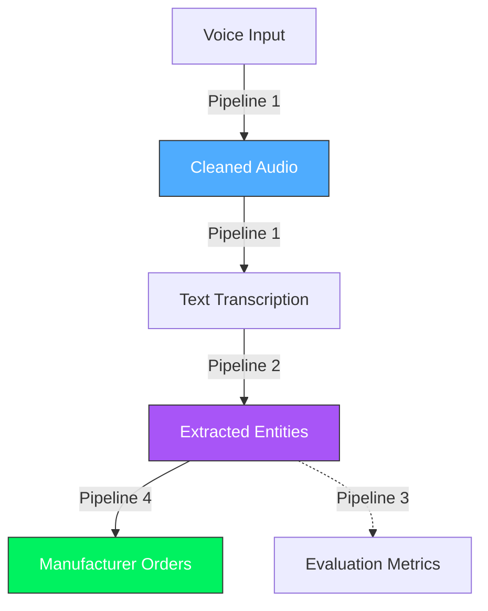

# Pharma Voice Orders - Architecture Documentation

## System Overview
This application enables pharmacists to place medicine orders using voice commands. The system transcribes speech, extracts medicine entities with high fault tolerance, routes orders to manufacturers, and provides evaluation metrics.

## Documentation Modules
The system architecture is broken down into the following detailed modules:

### 1. [Audio Pipeline](architecture/01_AUDIO_PIPELINE.md)
Detailed breakdown of the audio processing stages:
- **Preprocessing:** Resampling, VAD (Silence Trimming), and Spectral Gating.
- **ASR:** Whisper model integration (Local GPU vs. Cloud).

### 2. [Entity Extraction](architecture/02_ENTITY_EXTRACTION.md) (Updated)
Core intelligence of the system:
- **Dual-Layer Architecture:** Alias Resolution + Morphological Search.
- **Composite Scorer (ULTRATHINK):** 60/40 Weighted Ratio (Token Set + Partial).
- **Pharma Safety:** 75% "Trust Cliff" analysis.

### 3. [Evaluation Framework](architecture/03_EVALUATION.md)
How the system verifies its own accuracy:
- Ground Truth creation.
- Precision/Recall/F1 measurement.

### 4. [Components & Structure](architecture/04_COMPONENTS.md)
- Interaction flowcharts.
- File tree structure.
- Key method reference.

---

## High-Level Data Flow

