# Audio Pipeline Documentation

## 1. Audio Preprocessing - Detailed

The `AudioPreprocessor` class cleans raw audio for optimal ASR performance.

```mermaid
flowchart TD
    subgraph Input["📥 Input Handling"]
        A[Audio File/Bytes] --> B{File Type?}
        B -->|Path String| C[librosa.load directly]
        B -->|File-like Object| D[Seek to start]
        D --> C
    end
    
    subgraph Resampling["🔄 Resampling"]
        C --> E[Convert to 16kHz]
        E --> F[Convert to Mono]
        F --> G[NumPy Array]
    end

    subgraph VAD["✂️ Silence Trimming"]
        G --> V1[librosa.effects.trim]
        V1 --> V2{Valid Length?}
        V2 -->|Yes| V3[Trimmed Audio]
        V2 -->|No| V4[Original Audio]
    end
    
    subgraph NoiseReduction["🔇 Spectral Gating Noise Reduction"]
        V3 --> H{Length > 0.5s?}
        V4 --> H
        H -->|Yes| I[noisereduce.reduce_noise]
        H -->|No| J[Skip - Too Short]
        I --> K["Stationary Noise Profile<br/>(assumes constant background noise)"]
        K --> L[Cleaned Audio]
        J --> L
    end
    
    subgraph Normalization["📊 Amplitude Normalization"]
        L --> M[librosa.util.normalize]
        M --> N["Peak normalized to [-1, 1]"]
    end
    
    subgraph Output["📤 Output"]
        N --> O{Save to File?}
        O -->|preprocess_file| P[Save to Temp Directory]
        O -->|process| Q[Return NumPy Array]
        P --> R[Return Temp File Path]
    end
    
    style I fill:#ff6b6b,stroke:#333,color:#fff
    style M fill:#4facfe,stroke:#333,color:#fff
    style P fill:#00f260,stroke:#333,color:#fff
```

### Why These Steps?

| Step | Purpose | Library |
|------|---------|---------|
| **16kHz Mono** | Whisper expects 16kHz single-channel audio | `librosa` |
| **Silence Trimming** | Removes leading/trailing silence to save compute & improve ASR | `librosa.effects.trim` |
| **Noise Reduction** | Removes background hum, AC noise, mic static | `noisereduce` |
| **Normalization** | Consistent volume levels for better recognition | `librosa` |
| **Temp File** | Prevents polluting source folder with `_clean.wav` | `tempfile` |

---

## 2. ASR Transcription - Detailed

Two modes: **Local GPU** (faster, private) or **Cloud API** (no GPU required).

### Supported Models

| Model | Size | Speed | Accuracy | Use Case |
|-------|------|-------|----------|----------|

| `openai/whisper-medium` | 769M | ⚡ | ★★★★ | **Recommended** |
| `openai/whisper-large-v3-turbo` | 809M | ⚡ | ★★★★★ | Best accuracy |
