# Entity Extraction Documentation

## Fault-Tolerant Dual-Layer Architecture

> **You are not merely "searching text."** You are building a fault-tolerant bridge between imperfect human speech and rigid database records.

The system implements a **dual-layer retrieval strategy** designed to maximize recall without sacrificing precision.

```mermaid
flowchart TD
    subgraph Input["📝 Speech Input"]
        A["User says: 'askoril syrup'<br/>(ASR mishearing)"]
    end
    
    subgraph Layer1["🧠 LAYER 1: Semantic Shortcut (O(1))"]
        A --> B[_resolve_alias]
        B --> C{Found in aliases.json?}
        C -->|Yes| D["'askoril' → 'ASCORIL'<br/>Instant semantic resolution"]
        C -->|No| E[Pass to Layer 2]
    end
    
    subgraph Layer2["⚡ LAYER 2: Morphological Engine (O(N))"]
        D --> F[Composite Scorer]
        E --> F
        F --> G["Weighted Algorithm:<br/>• 60% Token Set<br/>• 40% Partial Ratio"]
        G --> H{Score ≥ 75?}
        H -->|Yes| I["✅ MATCH: ASCORIL<br/>Confidence: 91%"]
        H -->|No| J["❌ REJECT<br/>(Trust Cliff Protection)"]
    end
    
    subgraph Safety["🛡️ Pharma Safety Gate"]
        J --> K["Quarantine Queue<br/>(Human Review Required)"]
    end
    
    style B fill:#4facfe,stroke:#333,color:#fff
    style F fill:#a855f7,stroke:#333,color:#fff
    style H fill:#ff6b6b,stroke:#333,color:#fff
    style I fill:#00f260,stroke:#333,color:#fff
```



## Layer 1: Semantic Shortcut (Alias Resolution)

**Location:** `simulation/manufacturer_db.py` → `_resolve_alias()`

Before any fuzzy logic applies, a hard-coded **Alias Map** handles semantic mismatches:

```python
# data/aliases.json
{
    "ASCORIL": ["askoril", "ascoreal", "askril"],
    "PARACETAMOL": ["pcm", "crocin", "dolo"],
    "AUGMENTIN 625 DUO": ["augmentin", "augmentin duo"]
}
```

| Dimension | Justification |
|-----------|---------------|
| **Psychological** | Users speak in shorthand ("PCM" instead of "Paracetamol") |
| **Technical** | Fuzzy search is *morphological* (spelling-based). It cannot know "PCM" = "Paracetamol" because they share zero characters |
| **Performance** | Dictionary lookup is **O(1)** complexity, bypassing expensive O(N) string calculations |

## Layer 2: Composite Morphological Engine

**Location:** `simulation/manufacturer_db.py`

Instead of a generic `WRatio`, we use a **tuned composite scorer** specifically for pharmaceutical names:

```python
# Composite Scorer Logic
score = (0.60 * token_set_ratio) + (0.40 * partial_ratio)
```

### Why Composite? (Bias-Variance Optimized)

| Approach | Bias | Variance | Best For |
|----------|------|----------|----------|
| **Fixed WRatio** | Low (opaque algorithm) | Medium | General text matching |
| **Composite 60/40** | Tunable | Low (explicit weights) | **Pharma-specific tuning** |

1. **Token Set Ratio (60%)**: Handles word reordering and duplicates.
   - Example: *"625 Dolo"* matches *"DOLO-650"* strongly because the tokens "Dolo" overlap perfectly, even if order differs.
2. **Partial Ratio (40%)**: Handles substring matches.
   - Example: *"Augmentin"* matches *"Augmentin Duo"* because it is a substring.

## The 75% "Trust Cliff"

> [!CAUTION]
> In pharma, matching "Diazepam" to "Diltiazem" because of a low threshold is **dangerous**. These are completely different drugs with different effects.

| Threshold | Risk Profile |
|-----------|--------------|
| **< 60%** | 🔴 High FP rate. "Confident hallucinations" - algorithm matches anything |
| **60-74%** | 🟡 Moderate risk. Some valid matches, but also dangerous false positives |
| **≥ 75%** | 🟢 **Trust zone**. Filters out weak matches that "look similar" |
| **> 90%** | 🟡 Too strict. Misses valid speech variations |

## Full Text Normalization Pipeline

```mermaid
flowchart TD
    subgraph Input["📝 Raw Transcription"]
        A["'Um, send me FIFTY strips of dolo please'"]
    end
    
    subgraph Normalize["🧹 Normalization Steps"]
        A --> B["lowercase()<br/>'um, send me fifty strips of dolo please'"]
        B --> C["Remove ASR artifacts<br/>(&lt;/s&gt;, &lt;unk&gt;, &lt;s&gt;)"]
        C --> D["Remove fillers<br/>(uh, um, like, please, kindly)"]
        D --> E["Convert spoken numbers<br/>'fifty' → '50'"]
        E --> F["'send me 50 strips of dolo'"]
    end
    
    subgraph Segment["✂️ Segmentation"]
        F --> G["Split by: send|add|want|need|order|also|plus|then|and|,"]
        G --> H["Segment: '50 strips of dolo'"]
    end
    
    subgraph Extract["💊 Field Extraction"]
        H --> I["Quantity: regex (\\d+)\\s*(strips|bottles|...)"]
        I --> J["Dosage: regex (\\d+)\\s*(mg|ml|gm)"]
        J --> K["Form: keyword matching (tablet, syrup, cream)"]
    end
    
    style D fill:#ff6b6b,stroke:#333,color:#fff
    style E fill:#4facfe,stroke:#333,color:#fff
    style H fill:#00f260,stroke:#333,color:#fff
```


