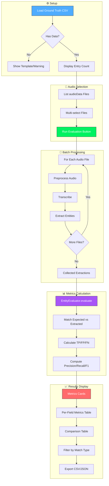

# Evaluation Framework Documentation

## Evaluation Workflow

## How to Create Ground Truth

### Option A: Manual (Recommended)
1. Open `evaluation/ground_truth.csv`
2. Listen to each audio file (e.g., `R_001.m4a`).
3. Add rows matching the audio:
    - `audio_file`: Filename (e.g., `R_001.m4a`)
    - `order_index`: 1, 2, 3...
    - `medicine_name`: **Must match `medicines.csv` exactly** (canonical name).
    - `quantity`: Spoken quantity (e.g., "50 strips").

### Matching Logic (EntityEvaluator)

| Field | Match Criteria | Example |
| :--- | :--- | :--- |
| **Medicine** | Fuzzy match > 85% OR exact string match | "DOLO 650" ↔ "DOLO-650" ✅ |
| **Quantity** | Number match + unit similarity | "50 strips" ↔ "50 strip" ✅ |
| **Dosage** | Normalized text match | "500 mg" ↔ "500mg" ✅ |

### Metrics Definitions

- **Precision**: (TP / (TP + FP)) — "How many of the *system's* findings were correct?"
- **Recall**: (TP / (TP + FN)) — "How many of the *actual* medicines did we find?"
- **F1 Score**: Harmonic mean of Precision and Recall.
