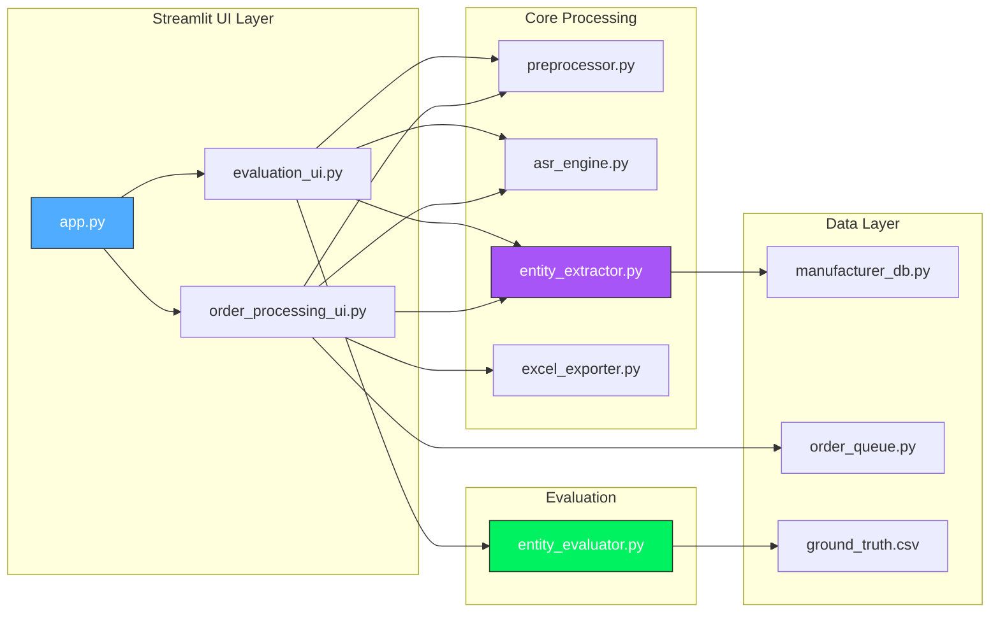

# Component Architecture



## File Structure

```
pharma-voice-orders/
├── app.py                      # Main Streamlit entry point
├── order_processing_ui.py      # Order Processing tab UI
├── core/
│   ├── preprocessor.py         # Audio preprocessing (VAD + noise reduction)
│   ├── asr_engine.py           # Whisper model loading & transcription
│   ├── entity_extractor.py     # NER + fuzzy matching + process_orders
│   └── excel_exporter.py       # Excel export utility
├── simulation/
│   ├── manufacturer_db.py      # Medicine/manufacturer logic (+ aliases)
│   └── order_queue.py          # Order queue management
├── evaluation/
│   ├── evaluation_ui.py        # Evaluation tab UI
│   ├── entity_evaluator.py     # Metrics calculation (TP/FP/FN/F1)
│   └── ground_truth.csv        # Expected values for testing
├── data/
│   ├── medicines.csv           # Medicine catalog
│   └── aliases.json            # Pronunciation aliases
├── audioData/                  # Test audio files
└── docs/
    └── architecture/           # Modular documentation
```

## Key Methods Reference

| Class | Method | Purpose |
|-------|--------|---------|
| `AudioPreprocessor` | `process(audio_file)` | Returns 16kHz numpy array (w/ VAD) |
| `AudioPreprocessor` | `preprocess_file(path)` | Returns path to cleaned temp file |
| `EntityExtractor` | `extract(text)` | Returns list of entity dicts |
| `EntityExtractor` | `process_orders(entities, db)` | Returns order dicts with manufacturer |
| `ManufacturerDB` | `get_manufacturer_by_medicine(name)` | Uses composite fuzzy scorer |
| `EntityEvaluator` | `evaluate(gt_df, extracted)` | Returns EvaluationReport |
